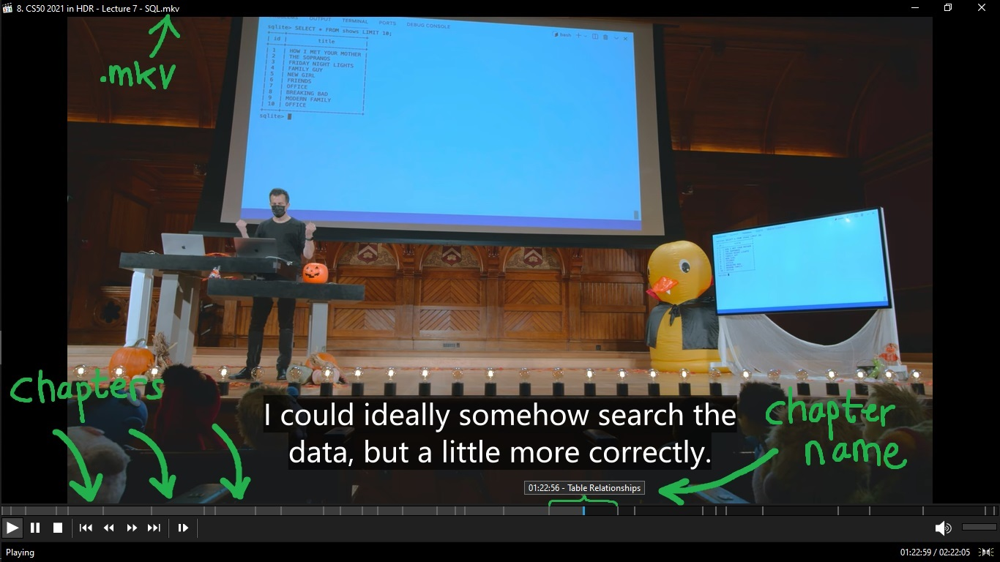

# video-chapter-generator

(Python Sripting) aplikasi ini akan consume/menggunakan **input.csv** dan produce/menghasilkan chapter file untuk video MKV yaitu **output.xml**



## Deskripsi aplikasi

### Input

isi dari file input harus persis berbentuk seperti pada file [test.csv](example/test.csv) dan pastikan sudah diurutkan berdasarkan waktu!

```c
00:00:00,Introduction
00:00:24,Object-Oriented Programming
00:01:00,Tuples
00:18:39,Dictionaries
00:26:45,Classes and Objects
00:39:18,Instance Methods
00:59:49,Validating Attributes
01:04:25,The String Method
01:11:13,Custom Methods
01:20:43,"Properties, Getters, and Setters"
01:42:33,Types and Classes
01:50:29,Class Methods
02:21:10,Inheritance
02:35:29,Operator Overloading
02:50:03,Conclusion
```

### Proses

**input.csv** akan diproses/di-format menjadi **output.xml** untuk chapter file yang bisa digunakan pada video.mkv

### Output

output file kira-kira akan seperti [test-output.xml](example/test-output.xml)

```xml
<?xml version="1.0"?>
<!-- <!DOCTYPE Chapters SYSTEM "matroskachapters.dtd"> -->
<Chapters>
  <EditionEntry>
    <EditionFlagDefault>1</EditionFlagDefault>
    <EditionUID>123456789012345678</EditionUID>
    <ChapterAtom>
      <ChapterUID>3000000001</ChapterUID>
      <ChapterTimeStart>00:00:00.000000000</ChapterTimeStart>
      <ChapterDisplay>
        <ChapterString>Introduction</ChapterString>
        <ChapterLanguage>und</ChapterLanguage>
        <ChapLanguageIETF>und</ChapLanguageIETF>
      </ChapterDisplay>
    </ChapterAtom>
    .
    .
    .
    <ChapterAtom>
      <ChapterUID>3000000015</ChapterUID>
      <ChapterTimeStart>02:50:03.000000000</ChapterTimeStart>
      <ChapterDisplay>
        <ChapterString>Conclusion</ChapterString>
        <ChapterLanguage>und</ChapterLanguage>
        <ChapLanguageIETF>und</ChapLanguageIETF>
      </ChapterDisplay>
    </ChapterAtom>
  </EditionEntry>
</Chapters>
```

### MKV

output berupa file **output.xml** yang dapat di-embed/di-merge/dimasukkan ke dalam file video berformat **MKV**

merge **output.xml** dapat dilakukan dengan software [MKVToolNix](https://mkvtoolnix.download/)
